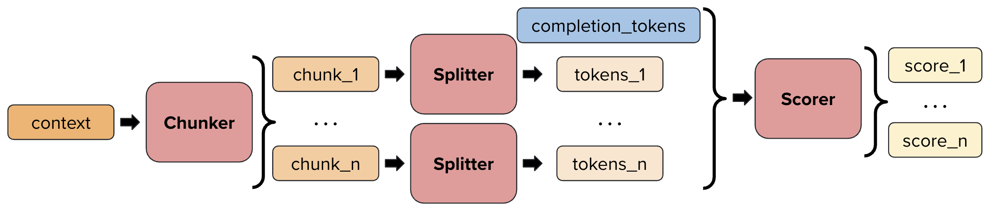
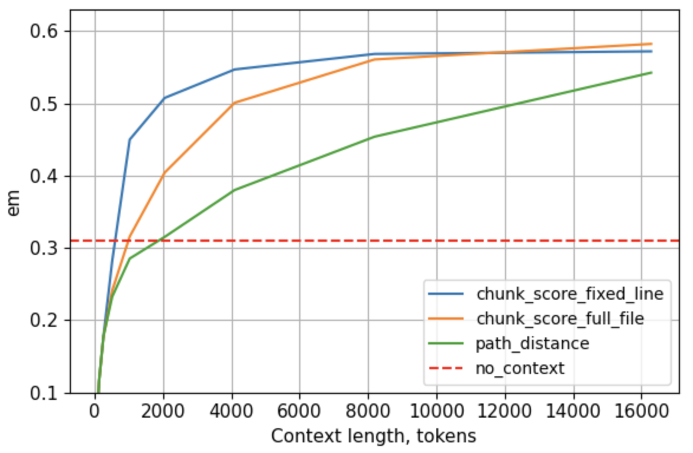

# RAG (Retrieval-Augmented Generation) for Code

This repository contains a RAG (Retrieval-Augmented Generation) system for code-related tasks, specifically focused on code completion and bug localization.

## Project Overview

The RAG system enhances language models by retrieving relevant context from a codebase before generating completions or localizing bugs. This approach improves the quality and relevance of model outputs by providing task-specific context.

In this project, we benchmark different approaches to RAG for code to recommend the best approach for various scenarios. We evaluate different chunking strategies, scoring methods, and context composition techniques to determine the most effective combinations.

The project consists of two main components:
1. **Code Completion**: Enhances code completion by retrieving relevant context from the codebase
2. **Bug Localization**: Identifies files likely to contain bugs based on issue descriptions

## Components

### Code Completion

The code completion component uses RAG to improve code suggestions by:
1. Chunking repository files into manageable pieces
2. Scoring chunks based on relevance to the current coding context
3. Using the most relevant chunks as context for code completion

Configuration options:
- Different chunking strategies (`full_file`, `fixed_line`, `langchain`)
- Various scoring methods (`BM25`, `IOU`, `dense` embeddings)
- Adjustable context sizes and composition strategies

Performance is evaluated using Exact Match (EM).


### Bug Localization

The bug localization component helps identify files likely to contain bugs by:
1. Taking issue descriptions as input
2. Chunking repository files
3. Scoring chunks based on relevance to the issue description
4. Aggregating scores at the file level to identify the most likely locations of bugs

Performance is evaluated using metrics like F1 score and NDCG.

### Chunk Pipeline

The chunking pipeline is a critical component of our RAG system, responsible for breaking down repository files into manageable pieces that can be efficiently processed and retrieved.



## Environment Setup

### Prerequisites

- Python 3.9+
- Poetry (for dependency management)

### Installation

1. Clone the repository:
   ```
   git clone https://github.com/JetBrains-Research/project-adaptation-experiments.git
   cd project-adaptation-experiments
   ```

2. Install dependencies using Poetry:
   ```
   poetry install
   ```

## Running Experiments

### Code Completion

To run code completion experiments:

1. Configure the experiment in `rag/configs/plcc.yaml`:
   - Set the model, language, and context composer
   - Configure context sizes and completion categories
   - Specify output paths

2. Run the evaluation:
   ```
   python -m rag.eval_plcc
   ```

### Bug Localization

To run bug localization experiments:

1. Configure the experiment in `rag/configs/bug_localization.yaml` and `rag/configs/rag.yaml`:
   - Set the chunker, scorer, and other parameters
   - Specify output paths

2. Run the evaluation:
   ```
   python -m rag.bug_localization
   ```

## Configuration Options

The system can be configured through YAML files in the `rag/configs` directory:

- `rag.yaml`: General RAG configuration (chunkers, scorers, models)
- `bug_localization.yaml`: Bug localization specific settings
- `plcc.yaml`: Code completion specific settings

## Experimental Results

Our benchmarking experiments have yielded several important insights:

- Larger the context of the generation model – larger chunks you should use. The minimal size of the context chunk is 32 lines.
- `IoU` + `line_splitter` is good on short contexts (<=2000) and very fast.
- The `word_splitter` and tokenizer has equal performance; the `word_splitter` is much faster.
- No need to include non-code files in this task. Saves plenty compute.

This plot shows the comparison of the explored context composer strategies:
- No Context (baseline)
- Path Distance (baseline), 
- optimal `full_file` composer configuration
- optimal `fixed_line` composer configuration

| **Parameter** | **Values** |
|-------------|----------|
| Chunkers | `full_file`, `fixed_line` |
| Scorer | `bm25` |
| Splitter | `word_splitter` |
| File extensions | [`py`] |
| Context chunk size | 32 lines (for `fixed_line`) |
| Completion chunk size | 32 lines (for `fixed_line`) |



To plot the results of the experiments we used `rag/plot_analysis/all_py_kt_plots.ipynb`

## Project Structure

- `rag/`: Main project directory
  - `bug_localization/`: Bug localization components
  - `configs/`: Configuration files
  - `context_composers/`: Context composition strategies
  - `draco/`: Data flow analysis components
  - `metrics/`: Evaluation metrics
  - `plot_analysis/`: Visualization tools
  - `rag_engine/`: Core RAG functionality (chunkers, scorers, splitters)
  - `utils/`: Utility functions

## Archive

Legacy code and experiments have been moved to the `archive/` directory.
